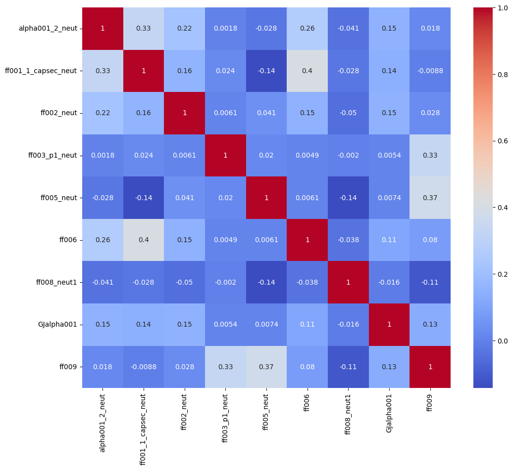

# MFE5210-Assignment
因子id:
'alpha001_2_neut',
'ff001_1_capsec_neut', 
'ff002_neut', 
'ff003_p1_neut', 
'ff005_neut', 
'ff006', 
'ff008_neut1', 
'GJalpha001', 
'ff009', 

因子相关性热力图:

平均夏普：2.49

因子来源：
1. WorldQuant Alpha101
2. 国泰君安Alpha191
3. 若干券商研报及论文
4. 常见技术指标